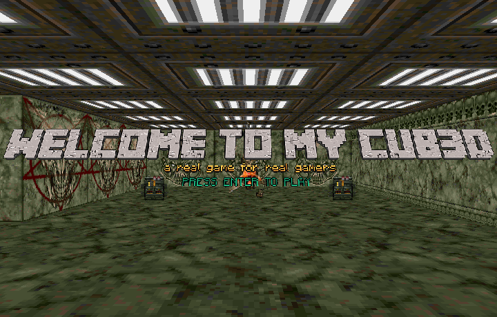

# Cub3D_linux

Cub3D is an individual school project at 42 Paris campus. It is Video game project inspired by Wolfenstein 3D using Minilibx library and ray-casting technology.

  

### Controls  
``W`` - move forward  
``S`` - move backward  
``A`` - move left  
``D`` - move right  
``↑`` - rotate up  
``↓`` - rotate down  
``←`` - rotate left  
``→`` - rotate right  

``SHIFT-L`` - Run  
``CTRL-L`` - Left Firing  
``CTRL-R`` - Right Firing  
``1`` - weapon slot 1 (when you are on the slot 1 press ``F`` and firing, it's a little surprise ;))  
``2`` - weapon slot 2 (Only when you pick up the minigun)
 
``ESC`` - exit  

### How to run  
`$> make`  for build librairy and program  
`$> ./cub3D map.cub`

### How to run bonus part
`$> make bonus`  for build with bonus part  
`$> ./cub3D map_bonus.cub`

### How to make a screenshot
`$> make` build if not already build  
`$> ./cub3D map.cub -save`

### Implemented bonuses  
- [x] wall collisions  
- [x] floor and ceiling textures  
- [x] a HUD
- [x] a shield bar
- [x] a life bar 
- [x] a ammunition counter
- [x] more items in the maze  
- [x] object collisions 
- [x] animations of a gun shot 
- [x] animation of game start and dead screen
- [x] enemy (not killable)
- [x] rotate the point of view with the mouse  
- [x] weapons
- [x] surprise !!

# END 115/100
